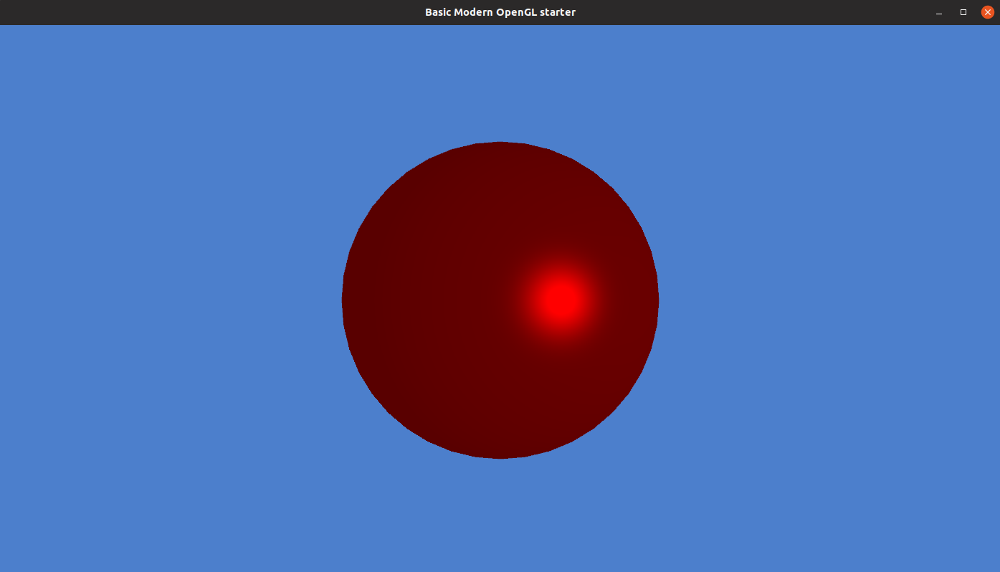

# OpenGL Starter

Basic OpenGL setup for adding shapes, textures, and VAOs, and for composing a scenegraph out of them for rendering.

## Installation
Make sure to have :
```bash
sudo apt install libopenal-dev libvorbis-dev libflac-dev xorg-dev
```
When cloning, make sure to use the --recursive flag for the submodules under /lib, or do this after : 
```bash
git submodule update --init
```
Run the glad.sh script under /lib
```bash
sh ./glad.sh
```
Run CMake in the root directory and cross your fingers! 

```bash
cmake .
```
Build :
```bash
make
```
Run :
```bash
./starter
```


## How to add new nodes
The routine for adding new nodes is outlined from "gamelogic.cpp", under initGame(GLFWwindow* window) : 
```C++
    /**
     * Create a shape(s)
     */ 
    Shape * sphere = new Sphere(0.5f, 40, 40, true);

    /** 
     * Initialize scene nodes. This allocates buffers and meshes.
     * Add texture path in the last argument in GeometryNode(..) for texture generation. 
     */
    rootNode = new EmptyNode();
    sphereNode = new GeometryNode(3, sphere, glm::vec3(0.0, 0.0, -1.0), ""); //Add texture in last arg if needed
    pointLightNode = new PointLightNode(6, pointLightPosition);

    /** 
     * Compose scenegraph (adding a sphere and a light to the root node)
     * Continue to push back other nodes as needed. 
     */
    rootNode->getChildren().push_back(sphereNode);
 ```
 See how the frames are updated and rendered in the same file as the scenegraph is parsed, as well as how shaders are loaded and how e.g uniforms are passed. 
 
To pass data to the shaders, note the first argument in GeometryNode() : 

```C++
GeometryNode(const int location, Shape * shape, const glm::vec3 position, std::string texturePath)
```
This is for the layout location in the shaders.Correspondingly in simple.vert : 

```C++
uniform layout(location = 3) mat4 M;
```

## Configuring VAO or texture generation further

See utilities/glutils.cpp

See also the mesh and shapes classes for how these buffers are created. 
    
